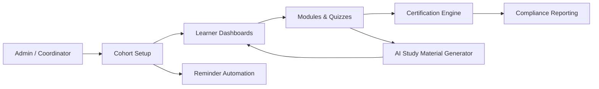
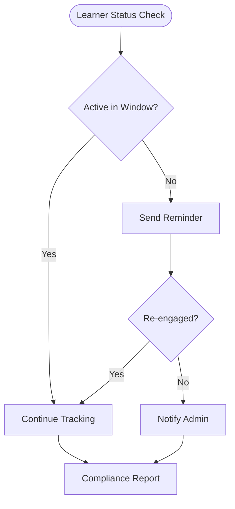

# AI Training Cohort System

AI-assisted training, certification, and compliance platform.

> Centralizes training delivery, learner engagement, certifications, reporting, and AI-assisted content workflows.
---

## Overview

A cohort-based training platform that combines learner management, certification tracking, reminder automation, and AI-generated study materials into one operational system.

## Problem

Training organizations often rely on:

- Manual tracking
- Disconnected spreadsheets
- Inconsistent reminders
- Static PowerPoints
- Limited learner visibility

## Operational Challenges

- No single source of truth for learner progress
- Certifications and compliance tracked manually
- High administrative overhead per cohort
- Content creation is slow and inconsistent

## Solution

This platform centralizes training delivery, learner engagement, certifications, reporting, and AI-assisted content workflows — reducing administrative load while improving learner outcomes.

## Features

- Cohort management
- Learner dashboards
- Certification tracking
- Reminder automation
- AI-generated study materials
- Compliance reporting
- Quiz workflows
- Certification logic

## Architecture

See [`docs/architecture.md`](docs/architecture.md) for the full cohort lifecycle, compliance loop, and AI study material diagrams.

## Workflow Example

1. Admin creates a cohort and enrolls learners.
2. Learners progress through modules and quizzes on their dashboards.
3. Reminder automation nudges inactive learners.
4. AI generates supplemental study materials on demand.
5. Certifications and compliance status roll up into reporting.

## Tech Stack

- Next.js / TypeScript
- Supabase
- OpenAI APIs
- Automation / reminder layer

## Screenshots

Cohort, certification, and compliance visualizations are maintained as Mermaid diagrams in [`docs/architecture.md`](docs/architecture.md). Example: the compliance & reminder loop.

## Lessons Learned

Engagement, not content, is the bottleneck. Automated reminders and AI-assisted materials move completion rates more than additional curriculum does.
