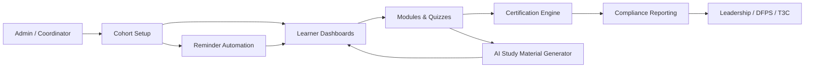
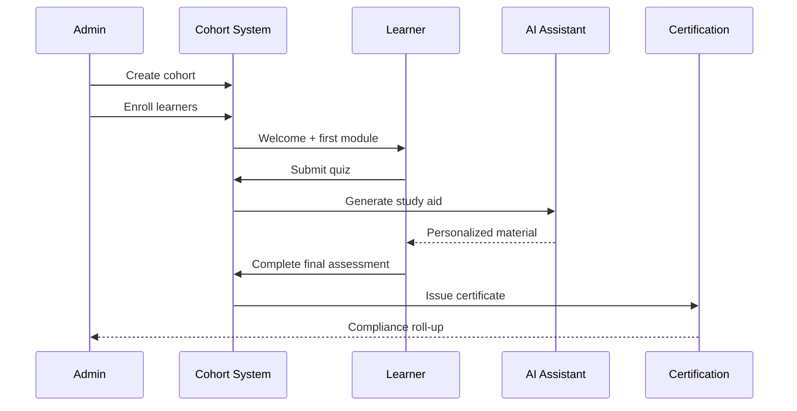
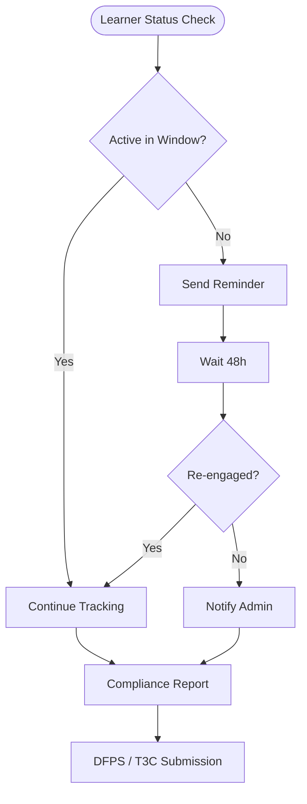
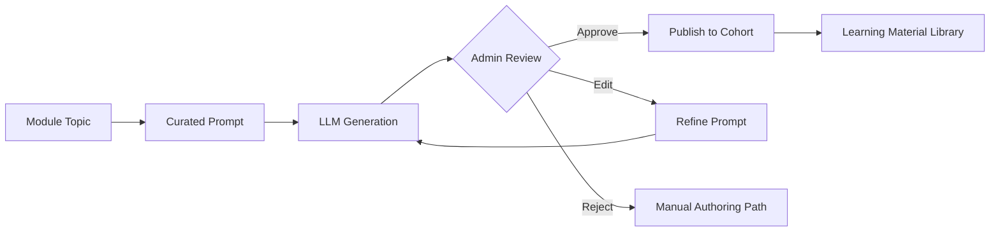

# AI Training Cohort System — Architecture

## System Overview

```mermaid
flowchart LR
    Admin[Admin / Coordinator] --> Cohort[Cohort Setup]
    Cohort --> Learners[Learner Dashboards]
    Learners --> Modules[Modules & Quizzes]
    Modules --> Cert[Certification Engine]
    Cohort --> Reminders[Reminder Automation]
    Reminders --> Learners
    Modules --> AI[AI Study Material Generator]
    AI --> Learners
    Cert --> Compliance[Compliance Reporting]
    Compliance --> Leadership[Leadership / DFPS / T3C]
```

## Cohort Lifecycle

```mermaid
sequenceDiagram
    participant Admin
    participant System as Cohort System
    participant Learner
    participant AI as AI Assistant
    participant Cert as Certification

    Admin->>System: Create cohort
    Admin->>System: Enroll learners
    System->>Learner: Welcome + first module
    Learner->>System: Submit quiz
    System->>AI: Generate study aid
    AI-->>Learner: Personalized material
    Learner->>System: Complete final assessment
    System->>Cert: Issue certificate
    Cert-->>Admin: Compliance roll-up
```

## Compliance & Reminder Loop

```mermaid
flowchart TD
    Start([Learner Status Check]) --> Active{Active in Window?}
    Active -->|Yes| Continue[Continue Tracking]
    Active -->|No| Remind[Send Reminder]
    Remind --> Wait[Wait 48h]
    Wait --> Check{Re-engaged?}
    Check -->|Yes| Continue
    Check -->|No| Escalate[Notify Admin]
    Continue --> Report[Compliance Report]
    Escalate --> Report
    Report --> DFPS[DFPS / T3C Submission]
```

## AI-Generated Study Material Flow

```mermaid
flowchart LR
    Topic[Module Topic] --> Prompt[Curated Prompt]
    Prompt --> AI[LLM Generation]
    AI --> Review{Admin Review}
    Review -->|Approve| Publish[Publish to Cohort]
    Review -->|Edit| Refine[Refine Prompt]
    Refine --> AI
    Review -->|Reject| Manual[Manual Authoring Path]
    Publish --> Library[Learning Material Library]
```
